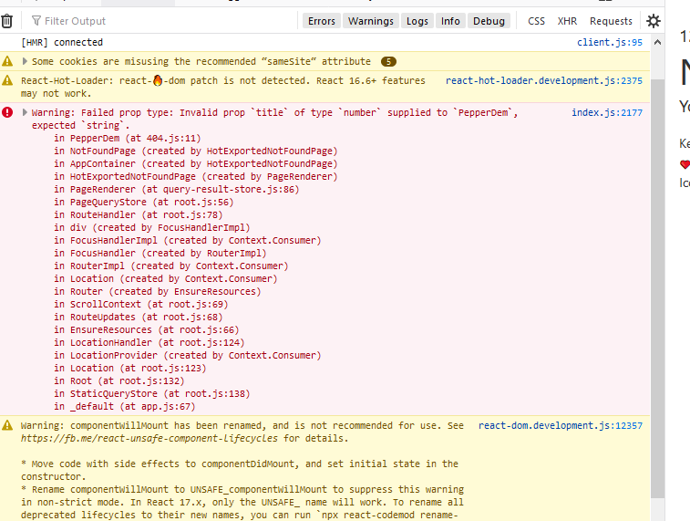

Making react component today is as easy as writing your first html with a sprinkling of few JavaScript words. React is becoming even more accessible to write compare to simple pure JavaScript functions.

By the end of this article, you should be able to:

- Define props and proptypes
- Mention few reasons to start using props and proptypes
- Use proptypes with functional and class component
- Appreciate what props and proptypes has for you

<div class="borderTop">
</div>
In this article, there will be an assumption that you are familiar with writing components in react.

So far you are cool with writing static components, but there is more to writing those static components. If static components is all you’re comfortable with, it doesn’t makes react any better than other server rendered html like we do in PHP.

You obviously want your amazing component to do just more like send data and receive one too. But before we get our hands dirty, if you’re like me, you would like to ask few questions.

##**What is Props?**

Props is an acronym for properties in react. Properties are like any variable in JavaScript that can be passed and used directly in a component or function. The variable can contain strings, object, arrays and any data types familiar with javascript. They are majorly read-only and not modifiable. However we have a special props called the children props (props.children).

##**What is PropTypes?**

Proptypes is basically an object where you need to define the type of props you want your components to receive. It is used to validate and document the intended types of properties passed into a component. React checks the passed props against the intended types and send a warning in the console if it doesn’t matches.

Proptypes is presently part of react core module. Few years back, you would have to install prop-types as standalone and import it. Today, it is always there for you to use and all you need is to import.

##**Why Should I use PropTypes?**

Why Should I use PropTypes since my components look cool without it?

Proptypes helps standardize your code. It makes you look like a react pro (don’t you??) and check your codes against unnecessary problems that may arrive with other developers using your component. Moreover, component are meant to be reusable and shared anyways.

To guide your future self and potential code users, it is advisable to use proptypes.

<div class="borderTop">
</div>

## **props with class component**

We’ve talked a lot we can get our hands dirty now. We will start with a simple class component and make the change to a functional component.

```javascript
    import React from “react”
    // bring in some components
    // here.
    import Header from “./header”
    import PepperDem from “./PepperDem
    import Footer from “./footer”


 Class App extends React.Component {
    render(){
        return (
            <Header />
            <PepperDem title='Digging Deep with React and Sekx' />
            <Footer />
        )
    }
}
export default App
```

To pass proptypes to our class component, there are two ways to do it:

- use static methods
- use direct function chaining

In this our case, we will stick to the use of static method. Check it below:

```javascript
    // the container component
    // Parent Component
    import React from "react"
    import PropTypes from "prop-types"

    Class PepperDem extends React.Component {
        static proptypes = {
            title: PropTypes.string.required
        }
        render(){
            return (
                <>
                    <div>
                        {this.props.title}
                    </div>
                </>
            )
        }
    }
    export default PepperDem
```
After you've done that, you too have become pro. You have successfully passed proptypes and validated stuff. 

If you try to pass number type, you would get a screaming error in your console.

```javascript
...

 Class App extends React.Component {
   ...
        <PepperDem title={12} />
   ...
}
export default App

```



<div class="borderTop">
</div>

## **props with functional component**

Functional component comes with a whole lot of advantages. The important ones for me are less typing(fewer codes) and lower barrier to use unlike the class component that requires the need to understand object oriented JS.

```javascript
    // the container component
    // Parent Component
    import React from "react"
    import PropTypes from "prop-types"

   export default function PepperDem(props) {
        return <>{props.title}</>
    }

    PepperDem.propTypes = {
      title: PropTypes.string.isRequired
    }

    export default PepperDem
```

Please, you can compare the changes with the functional and class component. But here is the most obvious:

- In class components, we use static methods to pass our propTypes object while,
- With functional component, we passed propTypes to the component prototype. More like functional chaining.

---

 <h3 style="color:#349077">
**Joke Time : dedicated to Morenike**
</h3>

Sing this nursery rhyme along with me

- Tinko, tinko, little star
- Howwa wonder whats so high
- Up abovedaa world so hi
- Like a diamond in the sky

---

 <h3 style="color:#349077">
**What if I interview you : little quick questions I try and answer myself**
</h3>

Which of this component will be rendered given that the Componenter below is true :

```javascript
{
  <Componenter /> || false // For example this will return <Componenter />
  false || <Componenter /> 
  false && <Componenter />
}
```

## **Closing Note**:

Props is cool, but with proptypes it even cooler.
There is need for developers to code with human in mind and consciously put in measures to mitigate problems and misunderstanding that might pop from using their piece.

In this regard, proptypes has come to the rescue.
