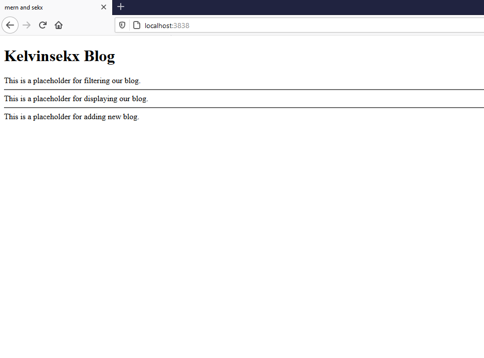

<div class="watchout">
Note this article is the continuation of the Digging Mern series. And the code here is an addition to the former code.
</div>

<div class="introduction">
In the <a href="/articles/mern-native-setup">previous article</a>, we accomplished a small react component. However, Hello World doesnot come close to the complex blog I talked about <a href="/articles/hello-mern/">here</a>. In this tutorial, you and I will start building react components that come closer to the said blog.
</div>

## **React Component**

React components can either be a javascript function or a javascript class. In this tutorial, I will  dwell in the class component rather than the function components to keep things simple for now.

It is perceived, or rather popular that class components has more features than function components. This is arguable. Being that with the advent of react hooks, function components can now do as much as class components would.

## **React Classes**

In this section, the plan is to convert the simple Hello World component into a React class so we all can start taking advantage of the class features.

Let's change the component at src/app.js so that it extends from React.Component:

```javascript
// src/app.js

...
class HelloWorld extends React.Component {
    ...
}
...
```

Within the class, the render method is the only compulsory thing. It helps us render the component to our browser. After which we will use the same JSX we had.

```javascript 
...
// the render method
render(){
    // returns the previous JSX
    return(
        <div>
            <h1>Hello World</h1>
        </div>
    )
}
...
```

Just like we had an instance of the div element created as `<div></div>`, you can also have an instance of the HelloWorld class created as 

```javascript
...
const Elem = <HelloWorld />
...
```
<div class="watchout">
If you try to pass the class into a variable instead you will get an error. You always need to instantiate the class like we did above.
</div>

```javascript
// if you do like this, you will get an error
const Elem = class HelloWorld extends React.Component{
    ...
}
...
```

## **Composing Components**

Now that you can create component with react, let's start making even more components and take better advantage of what react component has for us.

Let's define three placeholder classes - **BlogFilter**, **BlogPage** and **BlogAdd** - with a placeholder text within a div in each. The BlogFilter will look like this:

```javascript
//src/app.js
...
class BlogFilter extends React.Component {
    render(){
        return (
            <div>This is a placeholder for filtering our blog.</div>
        )
    }
}
...
```

The other two classes will be alike except for few difference in text.

```javascript
//src/app.js
...
class BlogPage extends React.Component {
    ...
            <div>This is a placeholder for displaying our blog.</div>
...
class BlogAdd extends React.Component {
    ...
            <div>This is a placeholder for adding new blog.</div>
...
```
Inorder to make everything appear on the screen. Replace the HelloWorld class with a new one.

```javascript
//src/app.js
...
class Blog extends React.Component {
    render(){
        return (
            <div>
                <h1>Kelvinsekx Blog</h1>
                <BlogFilter />
                <hr />
                <BlogPage />
                <hr />
                <BlogAdd />
            </div>
        )
    }
}
...
```

Instead of instantiating the HelloWorld Class, let's instantiate the Blog class instead.

```javascript
...
const Elem = <Blog />
...
```

Listing 2.1A shows src/app.js with all the changes.

```javascript
//Listing 2.1A

// src/app.js

class BlogFilter extends React.Component {
    render(){
        return (
            <div>This is a placeholder for filtering our blog.</div>
        )
    }
}

class BlogPage extends React.Component {
    render(){
        return (
            <div>This is a placeholder for displaying our blog.</div>
        )
    }
}

class BlogAdd extends React.Component {
    render(){
        return (
            <div>This is a placeholder for adding new blog.</div>
        )
    }
}

class Blog extends React.Component {
    render(){
        return (
            <div>
                <h1>Kelvinsekx Blog</h1>
                <BlogFilter />
                <hr />
                <BlogPage />
                <hr />
                <BlogAdd />
            </div>
        )
    }


const Elem = <Blog />

ReactDOM.render(Elem, document.getElementById('___root'))
```

The result of the code thus far will be an unintersting page.




